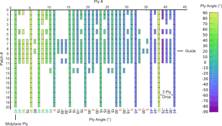

## Opti-BLESS Overview

The **Opti**misation of **BLE**nded **S**tacking **S**equence toolbox (**Opti-BLESS**) is a simple MATLAB toolbox allowing you to optimise patch-based stacking sequences including composite design guidelines. The code is easily accesible to everybody who posseses a basic understanding in classical laminate theory and optimisation. Detailed explanation about how to use the code are provided in the PDF file distributed with the code. Typical outputs obtained for the composite optimisation of an aircraft wing are shown in the figures below.

## Motivation

While the theory of stacking sequence optimisation is rather straightforward, its numerical implementation is something of a challenge and a time consuming task. At present time, only private tools are available for this purpose. The **Opti-BLESS** toolbox will give you a thouroughly validated set of building blocks required for stacking sequence optimisation. You can either use the toolbox as is or improve upon it and even make it yours. The ultimate goal of the developing toolbox, from my point of view, is to bridge the gap between the numerical and practical design of composite structures. Don't get me wrong, there is still quite some work left to be done in order bridge that gap but this toolbox at least provides a basis to start with. 

## Requirement

- MATLAB 2012 or more recent
- MATLAB Optimisation toolbox (GA)

## Installation

Once you have a suitable working version of MATLAB the toolbox can be run without additional instalations required. If this is your first time uing the toolbox you should start by running the Learn2Use.m examples.

## Tests

The toolbox has been thouroughly validated and is provided with a set of examples and benchmarks. Reaching 100% certainty in terms of validation is, however, impropable and possible errors may still be experienced. In this case, you can fix it and report it or simply provide feedback for me to be able to fix it (terence.macquart@gmail.com). Do not hesitate to aslo propose features you would like to be implemented.     

## Contributors

Terence Macquart - Instigator  

## License

The **Opti-BLESS** toolbox is distributed under a permisive 2-clause BSD license. You can redistribute and use the code in source and binary forms, with or without modification, provided that the redistributions retain the copyright notice, the list of conditions and the disclaimer.

## Release Update

Release 1.1.0 improves upon the previous version on the following point:

- Ply drops are replaced by ply insertion making easier to generate initial populations
- For sake a clarity the encoded solutions is replaced by its corresponding stacking sequence table in the source code
- Explicit and an implicit constraints for the 10% rule now have been added
- The plot function includes a new scaling inputs
- New learning examples have also been added
- Initial population generations has been greatly changes to increase its speed
